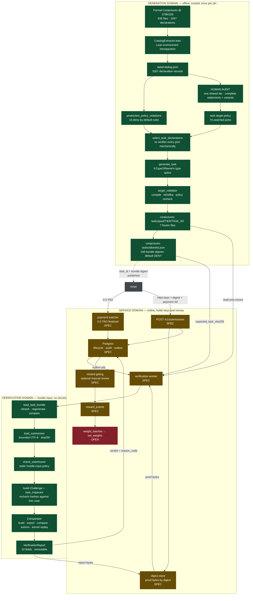

# Data flow: source theorem → reward

How data moves through the validator, what each stage consumes, what it produces, and which values
are load-bearing for trust. Every number here was computed from the pinned repository state at
`379fc0298dc146df549e7061c3ede0353a5bb51f`; the commands are reproducible from `data/catalog.json`
and `../conjectures-tasks/{allowlist.json,tiers/**/*.json}`.

Companion documents: [`SUBNET.md`](SUBNET.md) for the service contract,
[`../SECURITY.md`](../SECURITY.md) for the isolation boundary.

## Status legend

Roughly half of this pipeline exists as code and half as specification. Every stage below is tagged:

| Tag | Meaning |
| --- | --- |
| **BUILT** | Implemented, with a file reference. Behaviour described is what the code does. |
| **SPEC** | Described in [`SUBNET.md`](SUBNET.md), no implementation. Behaviour described is intended. |
| **OPEN** | Neither implemented nor decided. Listed in `SUBNET.md` "Decisions still required". |

The cut is clean and worth stating plainly: **everything from the upstream theorem to the immutable
verifier report is BUILT. Everything that moves money or weights is SPEC or OPEN.** The only chain
code in the repository is `conjectures_subnet/chain.py` — 38 lines, two classes, read-only.

## Two trust domains

Data crosses one hard boundary, and the direction of crossing is what makes the design work.

| | Generation domain | Verification domain |
| --- | --- | --- |
| Runs | Offline, once per dependency pin | Per submission, in a fresh container |
| Input trust | Trusted (upstream Lean source, human audit) | **Hostile** (miner-controlled bytes) |
| Network | Available | None |
| Secrets present | None needed | **None permitted** — no payment keys, no wallet keys, no DB credentials |
| Output | Immutable task bundles + digests | One immutable report |

Everything expensive, human, and judgement-based happens on the left. The right side receives only
a read-only task directory, bounded proof bytes, and an expected digest, and returns a verdict.
`SUBNET.md:113` states the rule; `SECURITY.md` defines the enforcement.

## The whole flow



---

# Stage by stage

## 1. Extraction — **BUILT**

`lean/CatalogExtractor.lean` → `data/catalog.json`

| | |
| --- | --- |
| **Primary source** | `vendor/formal-conjectures` at commit `379fc029…`, a Lean 4 project |
| **Needs** | The pinned toolchain `leanprover/lean4:v4.27.0`, Mathlib `a3a10db0…`, a full compile |
| **Produces** | 3,267 declaration records over 836 source files, plus `schema_version`, `repository_commit`, `lean_toolchain`, `mathlib_commit`, `extraction_duration_ms` |
| **Cost** | `extraction_duration_ms: 889692` — 14.8 minutes, once per pin |

The data does not come from parsing text. It comes from asking the compiled Lean environment about
each declaration, which is why fields like `depends_on_sorry` and `transitive_axioms` can be
trusted: they are the elaborator's answer, not a regex's guess.

**Trust-critical field produced here:**

- `type_hash` — SHA-256 over the declaration's elaborated type. This single value is the anchor for
  everything downstream. If the upstream statement changes by so much as an implicit binder, this
  changes, and every later stage notices.

Other fields consumed downstream: `category`, `classification`, `declaration_kind`, `is_prop`,
`depends_on_sorry`, `contains_sorry_in_type`, `contains_answer_annotation`, `formal_proof_kind`,
`formal_proof_link`, `transitive_axioms`, `module`, `source_path`, `theorem`, `type_pretty`.

## 2. Classification — **BUILT**

`verifier/classification.py` → the `classification` field, one of 11 `Classification` values.

This asks a shape question: *can a proof of this statement be checked mechanically without a human
deciding what the answer means?* The distribution over 3,267 declarations:

| Classification | Count | Usable as a paid task |
| --- | --- | --- |
| `DIRECT_PROP` | 2,605 | **yes** — statement is a closed proposition |
| `PROP_ANSWER_WRAPPER` | 306 | no — wraps an `answer` hole and requires an adapter |
| `POINTER_DECLARATION` | 211 | no — refers elsewhere |
| `GENERAL_VALUE_ANSWER` | 116 | no — needs an adapter |
| `NAT_ANSWER` | 20 | no for production — answer syntax |
| `UNSUPPORTED` | 8 | no |
| `DEFINITION_HOLE` | 1 | no |
| `BOOL_ANSWER`, `INT_ANSWER`, `FINITE_ANSWER`, `MULTIPLE_ANSWER_HOLES` | 0 each | — |

Only `DIRECT_PROP` survives into production. The reason is narrow and worth stating: for anything
with an answer hole, "correct" depends on what value the miner supplied, so acceptance would need a
policy about answers. `DIRECT_PROP` has no such freedom — either the proposition is proved or it is
not.

## 3. Curation — **BUILT** code, **HUMAN** input

This is the stage most people assume is automatic. It is not, and it is the most important stage in
the pipeline.

### The measured funnel

| Step | Rule | Remaining |
| --- | --- | --- |
| 0 | All declarations at the pinned commit | **3,267** |
| 1 | `category == "research open"` | **1,167** |
| 2 | `classification == DIRECT_PROP` | **988** |
| 3 | remaining exact-proposition safety rules | **988** |
| 4 | module under `ErdosProblems/` | **506** over 320 files |
| 5 | audited single-tier selection | **74** targets from 55 files |

The remaining exact-proposition checks currently remove nothing after the category and
classification filters. Those rules are defence in depth
against a future upstream revision, not live selection criteria — a useful thing to know before
anyone "optimises" them away, and a useful thing to re-measure after every pin bump, because the day
one of them starts firing is the day upstream changed something that matters.

### The 178 retired theorems

`../conjectures-tasks/tiers/tier-1/retired-source-theorems.json` names 178 source theorems that must never be offered again,
committed by both `theorem` name **and** `source_type_sha256` — so retiring survives a rename. Of
those, 88 intersect the eligible pool and 11 intersect the Erdős-eligible 121. Retirement is checked
by name *or* type hash at selection time (`task_pool.py:467-468`).

### Human picks, machine proves the pick is legal

The 74 targets are **not computed** from the 506. They are asserted by hand in one target file,
and `select_task_declarations` then
refuses to accept any pick that is not simultaneously:

- present in the audited selection with matching `source_path` and `erdos_problem_number`;
- present in the pinned catalog;
- passing all 10 production-eligibility rules;
- not retired by name and not retired by type hash;
- not a duplicate `type_hash` of an already-selected task;
- not under an excluded prefix.

Plus a floor: all 74 selections must be Erdős tasks or the build fails. All three audit inputs must carry the same
`repository_commit` as the catalog, or the whole selection is rejected up front.

Why human judgement is unavoidable here: a source file can hold a parent statement, variants,
partial results, and restatements. The one active tier admits complete problems and only those
independently meaningful parts and variants that passed the semantic audit.

The audit record is not a rubber stamp either. Each selected entry carries `upstream_status`,
`problem_tracker_status`, `open_prs_touching_source`, `active_resolution_prs`, and
`feasibility_signals`, screened against `teorth/erdosproblems` at commit `2e7e7a63…` with 281 open
upstream PRs considered. The file states its own limits:

> Plausibly attackable solver target; this is a comparative screen, not a claim that the conjecture
> is easy or guaranteed solvable.

## 4. Task generation — **BUILT**

`verifier/task_generator.py:213-346` → a bundle directory of exactly 7 files.

The central mechanism, and the thing that makes statement drift structurally impossible: the
generated `Challenge.lean` **never copies the statement text**. It asks Lean to splice the source
theorem's type in by name, via the custom elaborator `fcTypeOfName%` in `lean/TaskSupport.lean`.

A complete real bundle — `../conjectures-tasks/pool/tier-1/erdos-11-formalized/`:

```lean
-- Challenge.lean, 160 bytes, the entire task
import FormalConjectures.ErdosProblems.«11»
import TaskSupport

namespace Bounty

theorem target : fcTypeOfName% "Erdos11.erdos_11" := by
  sorry

end Bounty
```

The statement the miner must prove — never stored as text anywhere in the bundle:

```
∀ (n : ℕ), Odd n → 1 < n → ∃ k l, Squarefree k ∧ n = k + 2 ^ l
```

| File | Role |
| --- | --- |
| `Challenge.lean` | The task. Target theorem with `sorry`. |
| `SolutionHeader.lean.txt` | Prepended to the miner's proof — the imports and `namespace Bounty`. |
| `SolutionFooter.lean.txt` | Appended — `end Bounty`. |
| `manifest.json` | 25 fields; the task contract. |
| `source-metadata.json` | The catalog record for the source theorem, frozen. |
| `trusted-hashes.json` | Per-file SHA-256 of the 5 payload files. |
| `comparator-config.json` | What the Comparator must check. |

**Trust-critical manifest fields:**

| Field | Value in this bundle | Purpose |
| --- | --- | --- |
| `source_type_hash` | `sha256:7e9596e7…a19ea738` | The upstream statement's identity |
| `generated_target_type_hash` | `sha256:7e9596e7…a19ea738` | The generated target's identity — **must be equal in formalized mode** |
| `forbidden_dependencies` | `["Erdos11.erdos_11"]` | The proof may not cite the source theorem |
| `permitted_axioms` | `propext`, `Quot.sound`, `Classical.choice` | Whitelist; `sorryAx` is absent |
| `theorem_names` | `["Bounty.target"]` | What must be proved and exported |
| `production_eligible` | `true` | Gates the strict path |
| `task_mode` | `formalized` | The only mode |
| `timeout_seconds` | `3600` | Wall-clock cap |
| `max_submission_bytes` | `1000000` | Size cap |
| `trusted_file_hashes` | 5 entries | Must equal `trusted-hashes.json` |

Generation writes to a temp directory, validates, then publishes with `os.replace`; it refuses to
overwrite an existing bundle.

Note: `TaskManifest.max_submission_bytes` falls back to `5_000_000` when the key is absent
(`models.py:207`), while the generator's own default is `1_000_000`. Every pool manifest sets the
value explicitly, so nothing is currently affected — but a hand-written manifest that omits the key
gets a 5× larger cap than the generator would ever produce.

## 5. Generation-time audit — **BUILT**

`verifier/workspace.py:350-407`, `target_validator`

Before a bundle is allowed to exist, the generated Challenge is compiled and inspected. The task is
rejected unless the source hash is unchanged, the generated target is `isDefEq` to the source type,
and for formalized mode: `source_category == "research open"`, `declaration_kind == "theorem"`,
`depends_on_sorry` is true, `has_formal_proof` is false, the target contains no `sorry`, and the
axiom sets match.

This is why the pool policy records `compiled_target_validation: true` — eligibility is asserted
against a real Lean compile, not against JSON.

## 6. Commitment — **BUILT**

`../conjectures-tasks/allowlist.json`, schema version 7, `default: "DENY"`, enforced by
`task_registry.py` `assert_bundle`.

74 `allowed_source_theorems` and 148 `allowed_task_bundles`. Each bundle entry pins `task_id`,
`source_path`, `theorems`, `target_type_sha256s`, and:

- `task_bundle_sha256` — the whole-bundle digest, e.g.
  `sha256:31687f89…c903ef7d`

The bundle digest is computed by `sha256_named_bytes` (`verifier/hashing.py`), which
**length-prefixes each filename and each content block** so bytes cannot be shuffled between files
to collide.

The `tier-1` policy additionally commits to a hash of every audit input, so the allowlist cannot be
combined with a tampered audit file:

| Commitment | Covers |
| --- | --- |
| `selection_audit_sha256` | the tier's selected human reviews |
| `retired_source_theorems_sha256` | the 178 retirements |
| `task_targets_sha256` | the tier's exact targets and per-target reward identities |
| `task_groups_sha256` | the group policy (currently empty) |

The tier policy records its scope, exact target count, proof/refutation modes, and the
`stable-theorem-target-v1` reward rule. The one active tier has `multi_target_tasks: 0` and contains
all 74 Erdős targets.

**This file's integrity comes from being a hash-pinned file in an immutable image.** It should not
move into the database. A row is mutable by anything holding app credentials, and the attack it
enables is direct: add a task you already have a proof for.

---

## 7. Task publication — **SPEC**

The miner needs `task_id` and `task_bundle_sha256` to submit. Nothing publishes them yet; there is
no task-listing endpoint in the minimum API (`SUBNET.md:118-136`).

## 8. Payment — **SPEC**, with **OPEN** parameters

The miner transfers 0.5 TAO before submitting. The watcher confirms against *finalized* chain state,
checking recipient, asset, exact amount, sender policy, and uniqueness of the payment reference.

**Needs:** a chain transaction/extrinsic reference. **Produces:** a `payments` row — unique chain
reference, expected and observed sender and recipient, amount **as an integer in RAO**
(500,000,000 — never a float, `SUBNET.md:168`), asset and network, observed and finalized block,
confirmation state, linked submission, reconciliation timestamps.

The API must accept a payment *reference*, never a client-provided `paid: true`.

**OPEN:** which address receives the TAO, how many finalized blocks are required, and whether a
Lean-invalid proof consumes the payment or is refundable.

## 9. Submission intake — **SPEC**

`POST /v1/submissions`, idempotency key required.

**Needs from the miner:** idempotency key, authenticated identity, `task_id`, exact
`task_bundle_sha256`, payment reference, and the candidate `Main.lean`.

**Produces:** proof bytes in the object store keyed by content digest, plus one transaction writing
`artifacts`, `submissions`, and an outbox job.

**Write order matters and is not optional:** blob first, then the database transaction. A crash
between them leaves an orphan blob, which a reaper sweeps. Reversed, a crash leaves a paid
submission whose proof cannot be read.

The miner-supplied digest is a real gate — it must match an entry in the allowlist. A submission
naming a `task_bundle_sha256` that is not allowlisted must be refused before any Lean work happens.

Reusing an idempotency key with the same canonical request returns the original submission; reusing
it with different task, proof, miner, or payment data is a conflict.

## 10. Verification — **BUILT**

`verifier/verification.py` `verify()`, reached through
`verifier/service_adapter.py` `ProductionVerifierAdapter.verify_bytes`.

**Needs exactly four things**, and nothing else: a read-only task directory, the proof bytes, the
`expected_task_sha256`, and a fresh disposable workspace. No secrets, no network, no database.
`expected_task_sha256` is a **required** argument and is validated by `is_sha256`.

Ordered gates, each with a stable `reason_code`:

| # | Gate | Rejects with |
| --- | --- | --- |
| 1 | Bundle digest equals `expected_task_sha256` | `TASK_COMMITMENT_MISMATCH` |
| 2 | Task is production-eligible | `INELIGIBLE_TASK` |
| 3 | Dependency pins intact; FC commit matches manifest and checkout | `REPOSITORY_COMMIT_MISMATCH` |
| 4 | Per-file hashes match; payloads **regenerate byte-identically** | `TRUSTED_FILE_MODIFIED` |
| 5 | Proof is one regular non-symlink `.lean`, ≤ 1 MB, valid UTF-8, no NUL | `SUBMISSION_TOO_LARGE`, `SUBMISSION_NOT_UTF8`, `SUBMISSION_POLICY_VIOLATION` |
| 6 | Static policy: no forbidden dependency, no attributes, no top-level `#` commands | `SUBMISSION_POLICY_VIOLATION` |
| 7 | Live Landlock ≥ ABI 4 + seccomp probe passes | `INSECURE_SANDBOX` |
| 8 | Challenge builds | `CHALLENGE_BUILD_FAILED` |
| 9 | Source hash **recomputed from live Lean** equals the frozen hash | `SOURCE_TYPE_CHANGED` |
| 10 | Target hash matches manifest and `isDefEq` holds | `STATEMENT_MISMATCH` |
| 11 | Comparator: build, decl-filtered export, compare, axiom check, kernel replay | `SOLUTION_BUILD_FAILED`, `STATEMENT_MISMATCH`, `UNPERMITTED_AXIOM`, `LEAN_KERNEL_REJECTED` |
| 12 | Deadline not exceeded | `TIMEOUT` |

Gates 9 and 10 are the subtle ones. The manifest's hashes are not merely trusted from disk — they
are **recomputed against the compiled Lean environment on every single submission**. A bundle that
was valid when generated but whose upstream statement has since shifted fails here rather than
silently verifying the wrong theorem.

Gate 4 is stronger than a hash check: `load_task_bundle` re-runs the pure generator and compares the
result byte-for-byte (`task_loader.py:495-503`).

**Produces** a `VerificationReport` — 19 fields, of which the trust-critical ones are:

| Field | Meaning |
| --- | --- |
| `task_bundle_sha256` | Which exact task |
| `submission_sha256` | Which exact bytes — `sha256_bytes(raw)`, `submission.py:58` |
| `accepted` | The verdict |
| `reason_code` | One of 30 stable strings, the public API contract |
| `stage` | Where it stopped |
| `sandbox_mode` | Must be `landrun+seccomp` to be a production result |
| `checks` | 14 named booleans |
| `permitted_axioms` | The 3 allowed axioms |
| `repository_commit` | Which pin decided this |

Bulk fields — `stdout_tail`, `stderr_tail`, `theorem_names`, `duration_ms`,
`comparator_exit_code`, `workspace_retained`, `schema_version` — are diagnostic. Workspace paths are
sanitised out of both tails before the report is built.

The authoritative verdict comes only from the Comparator. **A successful `lake build` is never an
accepted result** — the miner controls the proof file, and `lake build` alone would accept a file
that builds while proving something else, or proves the target via `sorryAx`. Acceptance requires
the exported statement to match and the kernel to replay the proof term.

`nanoda` — an independent second kernel — exists in the pins but is `enabled: false`.

## 11. Report persistence — **SPEC**

Report bytes to the object store under their digest; one `verification_runs` row: submission ID,
attempt number, task and proof digests, verifier version and **immutable container digest**, start
and finish timestamps, verdict, reason code, stage, report artifact digest, retry metadata.

"Artifact" and "proof bytes" are not different kinds of thing. An artifact is any immutable blob
stored under its content digest; this system has exactly two — the miner's proof and the verifier's
report. The `artifacts` table is an *index* (digest → object key, length, media type, retention
state); it holds no bytes.

The distinction that matters is **terminal policy rejection vs. retryable infrastructure failure**.
`CONFIGURATION_REASONS` (17 of the 30 codes) already encodes this: those are operator faults, and a
worker must retry them rather than burn the miner's submission. `exit_code_for` maps accepted → 0,
policy rejection → 1, configuration fault → 2.

## 12. Reward gating — **SPEC**

Lean-valid proofs hit the captured review policy. The flag `MANUAL_REWARD_REVIEW_ENABLED` is global,
but each submission **captures the effective value and policy version** when it reaches gating, so
flipping the live flag cannot retroactively change an in-flight submission.

Enabled → `MANUAL_REVIEW_PENDING`, reward worker must ignore it, only an audited approval releases
it. Disabled → straight to `REWARD_ELIGIBLE`, still recorded as an automatic policy decision.

`review_decisions` is append-only: corrections create a superseding row. Review may weigh novelty,
duplication, eligibility, or abuse — it may **not** rewrite the Lean verdict.

**OPEN:** what criteria may reject a Lean-valid proof, whether there is an appeal, and whether
review is configured globally, per task, or per submission.

## 13. Reward event — **IMPLEMENTED SCHEMA**, payout execution **OPEN**

`reward_events` records the submission, eligibility reason, actual integer payout amount,
dynamic-pricing policy version and inputs, destination, attempt state, and finalized chain
evidence. The live policy reads the finalized bounty-wallet balance, durable target ages, and the set of
targets without a successful reward claim. The intake estimate is retained separately and is not
the amount-of-record.

### What the remaining weight/funding mechanism needs

| Required input | Status |
| --- | --- |
| Deterministic rule converting an eligible proof into Subnet 66 weights | **OPEN** — `SUBNET.md:305` |
| Scoring of duplicate valid proofs, repeat attempts, multiple solvers | **OPEN** — `SUBNET.md:304` |
| Per-task value signal | **Implemented for payouts.** `bounty_tasks.opened_at` produces the versioned age weight; no subjective difficulty score is used |
| Proof-of-inclusion returned to the miner | **OPEN** — `SUBNET.md:306` |
| `set_weights` submission and chain reconciliation | **Not implemented.** `chain.py` is read-only |

The payout rule is deterministic and its inputs are persisted. Converting validator funding into
Subnet 66 weights and returning proof-of-inclusion to the miner remain separate open components.

---

# Trust-critical value lineage

One chain of custody, from upstream Lean to the paid verdict. Each arrow is an equality that some
piece of code enforces.

```
Lean elaborated type of Erdos11.erdos_11
  │  CatalogExtractor.lean
  ▼
catalog.type_hash ─────────────── sha256:7e9596e7…a19ea738
  │  task_generator (formalized mode requires equality, task_generator.py:293)
  ▼
manifest.source_type_hash == manifest.generated_target_type_hash
  │  sha256_named_bytes over 7 length-prefixed files
  ▼
bundle.sha256 ─────────────────── sha256:31687f89…c903ef7d
  │  committed externally
  ▼
allowlist.allowed_task_bundles[].task_bundle_sha256
  │  passed in by the worker; required argument
  ▼
verify(expected_task_sha256=…) ── must equal recomputed bundle.sha256
  │  AND re-derived from live Lean per submission
  ▼
inspection.source_hash == manifest.source_type_hash     (gate 9)
inspection.target_hash == manifest.generated_target_type_hash, isDefEq  (gate 10)
  │
  ▼
VerificationReport.task_bundle_sha256 + .submission_sha256
```

The proof side is one hop: raw bytes → `sha256_bytes(raw)` → `Submission.sha256` →
`VerificationReport.submission_sha256` → object key. Store `raw`, never a re-encoded string; the
digest is over bytes, and a round trip through `str` risks a digest that no longer matches what was
verified. Because the key *is* the digest, `PUT` is idempotent, identical proofs deduplicate, and
re-hashing on read is a free integrity check.

---

# Known gaps

Ordered by how much they matter, not by where they appear above.

1. **Payout execution is not automated.** Dynamic pricing and its amount-of-record schema exist,
   but a production signer/reconciler still has to create and finalize the transfer safely.
2. **No task publication path.** Miners cannot discover `task_id` + digest, so no submission can be
   well-formed. This blocks the whole right-hand side.
3. **Group tasks commit only the primary target hash.** `task_generator.py:495` sets
   `generated_target_type_hash` from `generated_hashes[0]`, so a multi-source task would not commit
   its secondary targets. Currently latent: `../conjectures-tasks/tiers/tier-1/task-groups.json` has 0 groups and
   `tier_policies.tier-1.multi_target_tasks` is 0. Closing it needs a manifest schema bump.
4. **`nanoda` is pinned but disabled.** The second independent kernel is one config flag away and is
   the cheapest available increase in kernel-level assurance.
5. **8 of 10 production-policy rules currently select nothing.** Correct as defence in depth, but
   re-measure the funnel after every pin bump — one of them firing means upstream changed something
   that matters.
6. **No database, object store, event history, or queue.** Everything in stages 7–13 marked SPEC.

# Reproducing the numbers

Every count above comes from `data/catalog.json` and
`../conjectures-tasks/{allowlist.json,tiers/**/*.json}` at the pinned commit. The funnel
is `category == "research open"` then `classification == "DIRECT_PROP"`, then the remaining
`production_policy_violations` rules from `verifier/task_policy.py:53-82`, then the prefix and
audit-set intersections. Set membership for retirement is by `theorem` **or** `source_type_sha256`.
